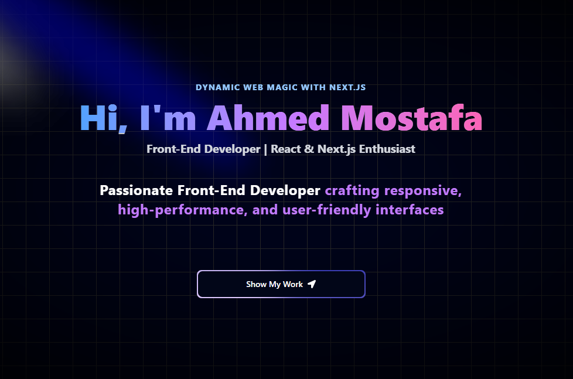

# 🚀 Ahmed Mostafa - Portfolio

Welcome to my personal portfolio website!  
Built with _Next.js 15, TypeScript, and Tailwind CSS, it showcases my projects, skills, and journey as a \*\*Frontend Developer_.

---

## 🔗 Live Demo

👉 [ahmedmostafa-portfolio.vercel.app](https://ahmedmostafa-portfolio.vercel.app)

---

## 🖼 Preview



---

## ✨ Features

- ⚡ _Modern UI_ with Tailwind CSS & shadcn/ui components
- 🎨 Smooth animations powered by Framer Motion
- 📂 Projects section with _live demos & GitHub links_
- 📱 Fully responsive design for all devices
- 📬 Contact form with validation & email integration

---

## 📂 Projects Highlighted in Portfolio

- _Redux Bank Project_ → Advanced state management with Redux Toolkit
- _AI SaaS (In Progress)_ → AI Interviews, Resume Reviews, Technical Questions
- _E-commerce App_ → Next.js + TypeScript + RTK Query (Login, Cart, Orders, Checkout)

---

## ⚡ Tech Stack


---

## 🚀 Run Locally

Clone the project:

```bash
git clone https://github.com/ahmedmostafa-io/ahmedmostafa-portfolio.git
cd ahmedmostafa-portfolio

Install dependencies:

npm install

Run the development server:

npm run dev


---

📬 Contact

Email: ahmedmostafa.codes@gmail.com

LinkedIn: https://www.linkedin.com/in/ahmed-mostafa-582378373/

GitHub: github.com/ahmedmostafa-io


---

✨ Crafted with passion by Ahmed Mostafa Ahmed Abdel-Aal

---
```
